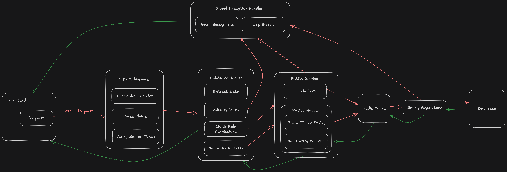

# Financial Manager Backend

A Spring Boot-based backend application providing secure authentication (JWT and OAuth2), role-based access control, and APIs for managing family financial assets, accounts, transactions, documents, and alerts.

## Table of Contents

- [Features](#features)
- [Tech Stack](#tech-stack)
- [Folder Structure](#folder-structure)
- [Getting Started](#getting-started)
  - [Prerequisites](#prerequisites)
  - [Installation](#installation)
  - [Configuration](#configuration)
  - [Database Setup](#database-setup--migrations)
  - [Running the Application](#running-the-application)
  - [Running Tests](#running-tests)
- [API Documentation](#api-documentation)
- [Architecture Overview](#architecture-overview)
- [License](#license)

## Features

- JWT-based OAuth2 and Credential authentication flow
- Refresh token persistence and revocation
- Fine-grained Role-Based Access Control (RBAC) with Roles and Privileges
- Multi-device login support with token limits
- Application-wide caching with Redis
- Secure logout with blacklisted JWTs
- CRUD operations for:
  - Users & Roles
  - Families & Memberships
  - Financial Accounts & Assets
  - Transactions with Categories
  - Documents with expiration reminders
  - Alerts

## Tech Stack

- **Language:** Java 21
- **Framework:** Spring Boot 3.4.3
- **Security:** Spring Security (OAuth2, Resource Server, Nimbus JWT)
- **Persistence:** Spring Data JPA, PostgreSQL, Hibernate
- **Caching:** Redis via Spring Cache
- **Build Tool:** Gradle
- **Testing:** JUnit, Mockito
- **Mapping:** MapStruct

## Folder Structure

```
src/
├── main/
│   ├── java/com/ratnesh/financialmanager
│   │   ├── config          # Security, JWT, Redis configs
│   │   ├── controller      # REST controllers
│   │   ├── dto             # Data Transfer Objects
│   │   ├── exception       # Custom exceptions & handlers
│   │   ├── mapper          # MapStruct mappers
│   │   ├── model           # JPA entities & enums
│   │   ├── repository      # Spring Data repositories
│   │   ├── security        # Filters, providers, and services
│   │   └── service         # Business logic services
│   └── resources/
│       └── application.yml # Application properties
└── test/
    └── java/com/ratnesh/financialmanager  # Unit and integration tests
```

## Getting Started

### Prerequisites

- Java 21
- Maven 3.16.4+
- PostgreSQL 12+
- Redis

### Installation

1. Clone the repository:

   ```bash
   git clone https://github.com/theyorouzoya/financial-manager.git
   cd financial-manager
   ```

2. Build the project:

   ```bash
   ./gradlew clean build
   ```

### Configuration

The `application.yml` file contains the necessary configurations for the application. The `spring.config.import` variable allows importing environment values via a `.env` file in the root folder. While some defaults are provided for most variables, you need to set some of the environment variables to their proper values for the app to run.

#### Environment Variables

- To support OAuth login via GitHub, [create a GitHub OAuth app as shown here](https://docs.github.com/en/apps/oauth-apps/building-oauth-apps/creating-an-oauth-app). Once you've obtained
the your GitHub client ID and have generated a client secret, set the following environment
variables to their appropriate value:
  - `GITHUB_CLIENT_ID`
  - `GITHUB_CLIENT_SECRET`


- This application uses a hardcoded asymmetric key-pair to sign and encode JWTs. First, generate an RSA key pair. For example, you can use OpenSSL to generate them for you:
  ```bash
  # Generate private key (2048-bit RSA)
  openssl genpkey -algorithm RSA -out private_key.pem -pkeyopt rsa_keygen_bits:2048

  # Extract the public key from the private key
  openssl rsa -pubout -in private_key.pem -out public_key.pem
  ```
  Place the generated keys in a location of your choice (preferably on the classpath, for example, `/resources/keys/`) and set the following environment variables to point to their location:
  - `PUBLIC_KEY_PATH`
  - `PRIVATE_KEY_PATH`

  If you're putting them on the classpath as shown above, then you can refer to the path as `classpath:keys/`. Otherwise, you will need to supply the full directory path to the location.

- The expiration time for the access token (the JWT) and the refresh token can be configured by setting the following variables:

  - `JWT_EXPIRATION_MS`: `900000`. The expiration time (in ms) for a JWT. Default is 15 minutes.
  - `REFRESH_TOKEN_EXPIRATION_MS`: `604800000`. The expiration time (in ms) for refresh tokens. Default is 7 days.

- This application uses Redis to cache frequently accessed resources and to blacklist JWTs upon logout. The following variables can be configured to setup the connection:
  - `REDIS_HOST`: `localhost`. Your default host url for the Redis server.
  - `REDIS_PORT`: `6379`. The post the Redis server accepts connections on.
  - `REDIS_TIMEOUT`: `30000`. The connection timeout value (in ms) for the Redis server.

### Database Setup

By default, the application expects a database by the name of `familyfinance` to exist. So if you want to use the default value, create a postgres database by that name. Otherwise, setup your db and supply the following environment variables:
- `DATABASE_URL`: `jdbc:postgresql://localhost:5432/familyfinance`. Your postgres database connection url.
- `DATABASE_USERNAME`: `postgres`
- `DATABASE_PASSWORD`: `postgres`

This project does not use a migration tool at the moment. The `spring.jpa.hibernate.ddl-auto` variable is set to `update` as the default.

### Running the Application

```bash
./gradlew bootRun
```

The API will be available at `http://localhost:8080/api/v1/` by default.

### Running Tests

Run all unit and integration tests:

```bash
./gradlew test
```

## API Documentation

The app has Swagger UI integration. Once the application is up and running, the API can be accessed at the default Swagger link `http://localhost:8080/swagger-ui/index.html`.

See [docs/API.md](docs/API.md) for full endpoint documentation, request/response schemas, and examples.

## Architecture Overview

The app follows a layered monolithic architecture with the standard division into Filters, Controllers, Services, and Repositories with objects modeled as Entities and DTOs.



See [docs/ARCHITECTURE.md](docs/ARCHITECTURE.md) for detailed design, sequence diagrams, and component interactions.


## License

This project is licensed under the MIT License. See [LICENSE](LICENSE) for details.


