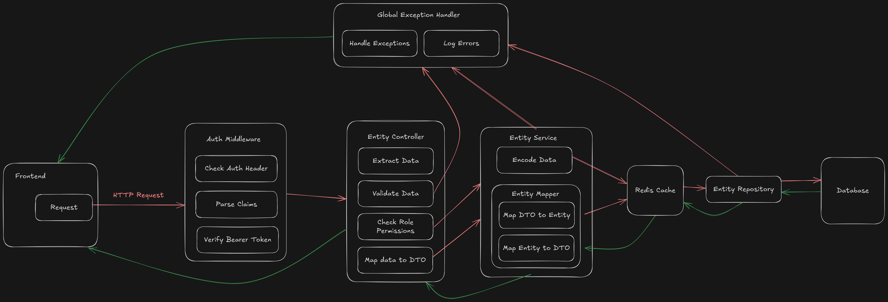

# Application Architecture

The app follows a layered monolithic architecture with the standard division into Filters, Controllers, Services, and Repositories with objects modeled as Entities and DTOs.

Starting from a web request's viewpoint, we divide the application into several layers:

## **Security Layer**: 

### Authentication 

Since we're using JWTs, incoming requests to authenticated endpoints will need to present a valid bearer token within the HTTP Authorization header. In case a request to an authenticated endpoint doesn't present a bearer token, the server redirects the client to the configured login page. Since the app also supports a standard credentials login, a client can make a POST request to the `/api/v1/auth/login` endpoint with the proper credentials and get the `accessToken` and `refreshToken` pair. The sequence follows as per the diagram below.

Once the client obtains their `accessToken` from the server, they can attach it to their subsequent requests and access the protected resources according to their authorization level. By default, `accessTokens` are short-lived and expire in 15 minutes, while a `refreshToken` is persisted in the database for 7 days.

In case of the OAuth2 flow, the user is redirected to the OAuth provider's website (i.e., GitHub) for authentication. Once the user authorizes the application, the standard OAuth2 token exchange happens between the server and the OAuth provider. The server then fetches the relevant details using the user's access token for the OAuth provider and either creates and/or logs the user in.

Once an `accessToken` expires, the client can issue another one by making a POST request to the `/api/v1/auth/refresh` endpoint with their previously-issued `refreshToken`.

### Authorization

Since the app uses a Role-Based Access Control system, route controllers are annotated with appropriate role-level and privilege-level authorization annotations to filter out incoming requests. To facilitate with this process, the `accessToken` stores the user's `id`, `familyId`, `roles`, and `privileges`. Since the `accessToken`s are shortlived, we don't have to worry about changes to a user's granted authorities being out of sync in auth flow. Plus, the frontend can be configured to refresh the client's `accessToken` upon a role or privilege change.

### Logout

Since JWTs are stateless, logging a user out presents its own challenges. If the server isn't keeping track of which user is logged in, how do we log them out? While shortlived JWTs solve most of this problem, upon receiving a logout request, the server adds the user's current `accessToken` to a blacklist. This blacklist exists purely at the cache level and is managed as a `RedisTemplate` with individual time-to-live for each token on the list. All requests to authenticated routes pass through a blacklist filter where the incoming bearer token is quickly checked if it is blacklisted. If it is, the server rejects the request.

## Controller Layer

Once authenticated, requests are forwarded to the appropriate controllers. First, the authorization annotations (e.g., `@PreAuthorize`, `@hasRole`, and `@hasAuthority`) take care of checking the required permissions in the incoming JWT. Then, the request arguments are validated against any respective DTO or Path Variable definitions as per the `@Valid` and `@Validated` annotations. Finally, the controller calls the appropriate service layer method and passes the request arguments to it. The return value is then packaged up in a `ResponseEntity` and sent back to the client.

## Service Layer

Service layer handles core bussiness logic for the application. This is also where most of the fine-grainded vetting and validation checks are performed. The layer interfaces with the repository layer (or the data access layer) to get the required data. Finally, as needed, the fetched entity is mapped onto the appropriate Data Transfer Object using the Mapstruct mappers and returned to the controller layer.

## Repository Layer

For the simpler CRUD operations, the repository layer relies on the standard JPA Query Method syntax to read and write data into the database. Though, there are a few custom queries here and there where Hibernate leads to inefficient database operations (like deleting all refresh tokens by user ID). We also leverage the Transaction capabilities JPA offers via the `@Transactional` annotations to ensure proper transaction processing.

## Cache Layer

In between our Service Layer and the Repository Layer (or Data Access Layer) sits our Redis Cache instance. Service methods are annotated with the appropriate `@Cachable`, `@CachePut`, and `@CacheEvict` annotations to return fast responses from repeated database queries. As mentioned before, the cache also keeps track of blacklisted JWTs as a separate `RedisTemplate`, where each entry has its own time-to-live. The serive layer cache uses a configured time-to-live as per the `application.yml` file's `spring.data.redis.timeout` value.

Putting all these components together in a flowchart looks like this:

